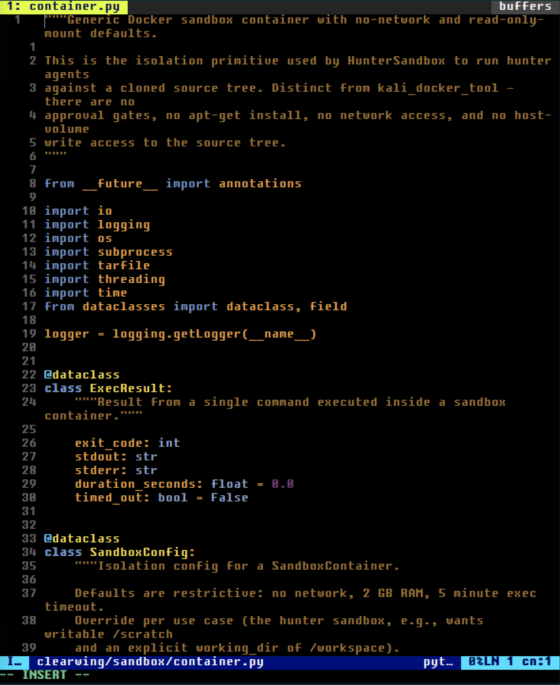
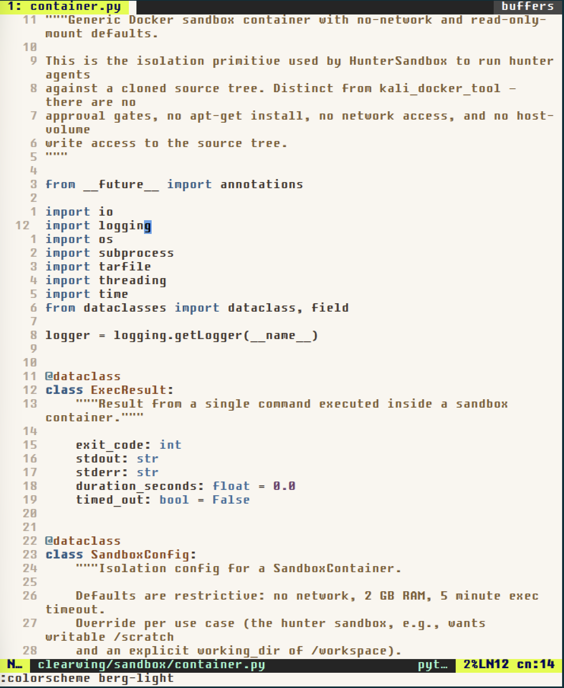

# Neovim Easy Configuration

A simple editor configuration for Neovim with CUA (Common User Access) shortcuts, tab bar, mouse support, and menu bar. Uses the Berg colorscheme, inspired by Bloomberg terminals.

## Features

- Starts in insert mode — behaves like a normal text editor
- CUA keyboard shortcuts (Ctrl+C, Ctrl+V, etc.)
- Tab bar for open buffers
- Mouse support
- Menu bar (File/Edit/View/Help)
- Berg theme — dark and light variants (F4 to toggle)

## Screenshots

### Dark theme (Berg)


### Light theme (Berg Light)


## Installation

### Quick install

#### Linux / macOS
```bash
curl -fsSL https://raw.githubusercontent.com/norandom/nvim-simple/main/install.sh | bash
```

#### Windows

Install Neovim with `winget` (recommended):

```powershell
winget install --exact --id Neovim.Neovim
```

Close and reopen PowerShell after `winget` finishes, then verify the installation:

```powershell
nvim --version
```

If `winget` is unavailable, Scoop is an alternative:

```powershell
scoop install neovim
```

Install this configuration:

```powershell
iwr -useb https://raw.githubusercontent.com/norandom/nvim-simple/main/install.ps1 | iex
```

Or clone/download this repository and run the installer from its directory:

```powershell
Set-ExecutionPolicy -Scope Process Bypass
.\install.ps1
```

The process-scoped execution-policy change applies only to the current PowerShell session. The installer uses Neovim's Windows config directory, normally `%LOCALAPPDATA%\nvim`.

It will:
- Back up any existing Neovim config
- Download and install the configuration
- Install vim-plug and all plugins
- Set up the Berg colorscheme

### Manual installation

1. Ensure you have Neovim installed
2. Clone this repository: `git clone https://github.com/norandom/nvim-simple.git`
3. Copy the `nvim` directory to:
   - Linux/macOS: `~/.config/nvim`
   - Windows: `%LOCALAPPDATA%\nvim`
4. Open Neovim - plugins will auto-install on first run

### Temporary trial (no install)

Try the configuration without installing:
```bash
curl -s https://raw.githubusercontent.com/norandom/nvim-simple/main/nvim/init.vim > /tmp/nvim-config.vim && nvim -u /tmp/nvim-config.vim +PlugInstall +qall && nvim -u /tmp/nvim-config.vim
```

## Keyboard shortcuts

### CUA mode (standard editor shortcuts)
- **Ctrl+C** - Copy selected text
- **Ctrl+X** - Cut selected text
- **Ctrl+V** - Paste text
- **Ctrl+A** - Select all text
- **Ctrl+S** - Save file
- **Ctrl+Z** - Undo
- **Ctrl+Y** - Redo

### File operations
- **Ctrl+N** - New file
- **Ctrl+O** - Open file
- **Ctrl+W** - Close current tab/buffer

### Tab navigation
- **Ctrl+T** - Open new tab
- **Ctrl+Tab** - Next tab
- **Ctrl+Shift+Tab** - Previous tab

### Interface
- **F10** - Open menu bar
- **F2** - Toggle file explorer (NERDTree)
- **Esc** - Exit insert mode (but arrow keys return to insert mode)

### Movement in insert mode
- **Arrow Keys** - Move cursor while staying in insert mode
- **Home/End** - Move to beginning/end of line
- **Page Up/Down** - Page navigation

### Terminal mode
- **F3** - Open terminal in new tab
- **Ctrl+C** - Send interrupt signal (works in terminal mode)
- **Ctrl+PageUp/PageDown** - Navigate between tabs from terminal
- **Esc** - Exit terminal mode to normal mode (for scrolling/copying)

## Menu bar

Press **F10** to access the menu bar with the following options:

### File menu
- New (Ctrl+N)
- Open (Ctrl+O)
- Save (Ctrl+S)
- Save As
- Close (Ctrl+W)
- Exit

### Edit menu
- Undo (Ctrl+Z)
- Redo (Ctrl+Y)
- Cut (Ctrl+X)
- Copy (Ctrl+C)
- Paste (Ctrl+V)
- Select All (Ctrl+A)

### View menu
- File Explorer (F2)
- Toggle Line Numbers

### Help menu
- About

## Plugins used

- **vim-plug** - Plugin manager
- **vim-airline** - Status line and tab line
- **vim-buftabline** - Buffer tabs
- **vim-quickui** - Menu bar interface
- **nerdtree** - File explorer
- **vim-devicons** - File icons

## Theme configuration

The configuration uses the **Berg** colorscheme, based on Bloomberg terminal aesthetics:
- Dark theme with black background (#000000)
- Orange primary text (#f49f31) for contrast
- Red comments (#d54135)
- Supports Treesitter and LSP
- Custom highlights for Telescope, NvimTree, GitSigns

## Customization

The main configuration file is `nvim/init.vim`. You can modify:
- Color scheme settings
- Keyboard shortcuts
- Plugin configurations
- Menu bar contents

## Recent bug fixes

### Terminal Neovim compatibility
- Fixes E519 error by patching vim-buftabline to work with terminal Neovim (the `guioptions` issue)
- Ctrl+C in terminal sends interrupt signal to running processes
- Patches are applied automatically on first load

## Troubleshooting

If plugins don't load:
1. Open Neovim
2. Run `:PlugInstall` to install plugins
3. Restart Neovim

If colors look wrong:
1. Make sure your terminal supports 256 colors or true color
2. Check that `termguicolors` is enabled

## Development

The repository uses [pre-commit](https://pre-commit.com/) to lint the maintained Vimscript with Vint and check Lua formatting with StyLua. The vendored `nvim/autoload/plug.vim` file is excluded from Vint.

Install the Git hook once after cloning:

```powershell
pre-commit install
```

Run every check manually with:

```powershell
pre-commit run --all-files
```

## Philosophy

This config makes Neovim behave like a normal text editor. Standard shortcuts, mouse support, tabs, a menu bar. You get the ergonomics of a conventional editor without giving up Neovim's underlying power.
